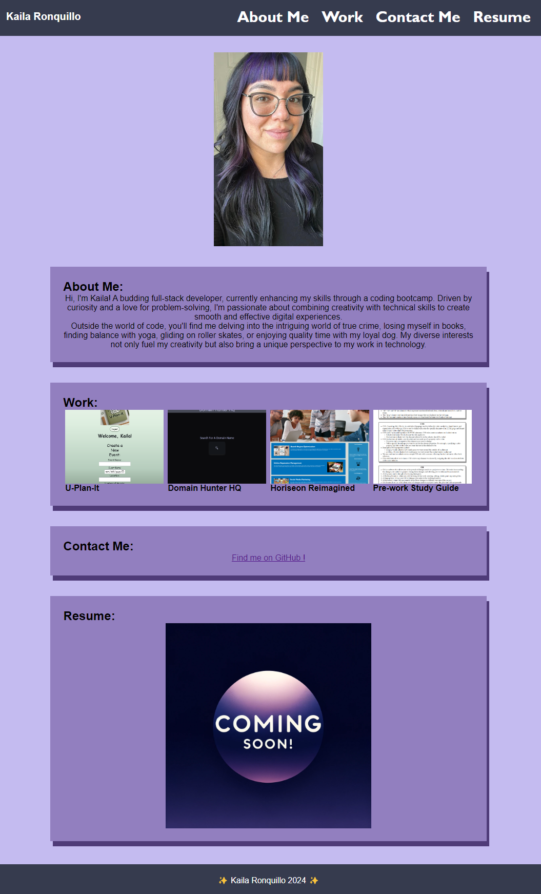

# Kailas-Dev-Diary

## Welcome to my developer portfolio!

- This project is a display of my newly gained knowledge of coding. As I progress in my career, I plan to continuously update this portfolio to reflect my evolving skills and newly deployed projects.

## This Portfolio is designed to be a dynamic and responsive website. It's all about my journey in development and the things I've learned thus far.

- I used flexbox for neat and flexible layouts. This keeps everything looking nice and organized.

- I used Media Queries to make sure the site works great on anything from phones to desktops.

- I used CSS Variables for easy styling and to keep the site looking consistent.

### This portfolio will be continuously growing, just like my skills!

## Collaborators

This project was made possible with the help of:

[Jordan Gonzales](https://github.com/JordanGWiz)

[Adam Rosenberg](https://github.com/AcoderRose)
